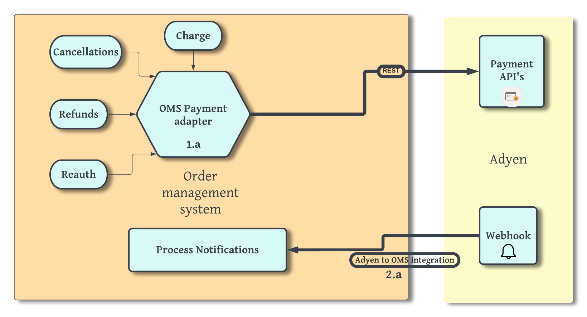
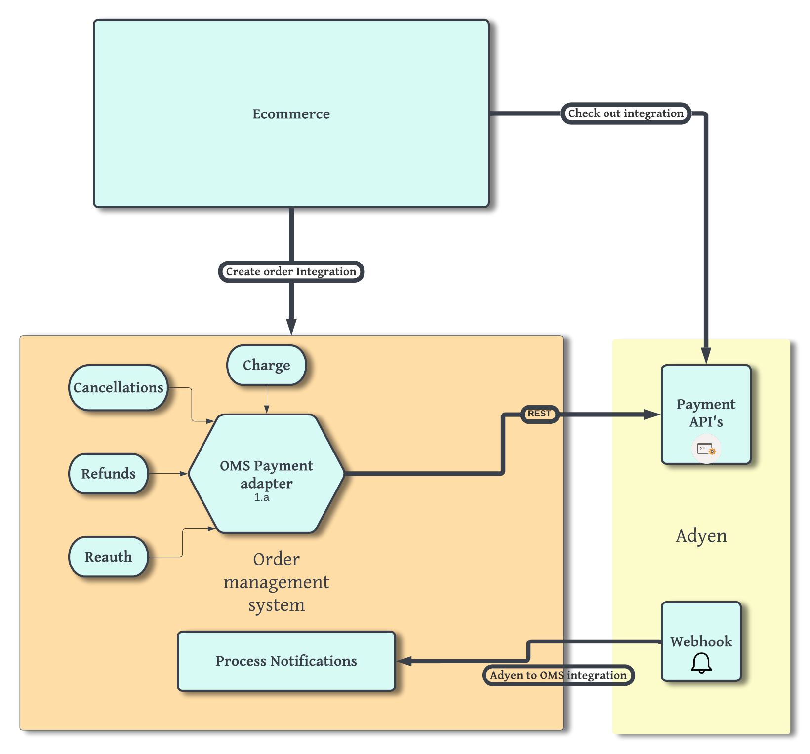
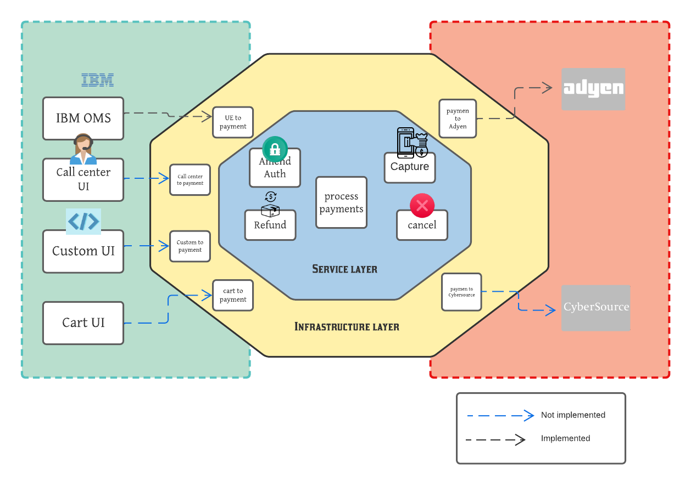

<h1>OMS payment adapter</h1>

This is a java based library that can be used to connect Order management system with Payment service providers(PSP). This version of the adapter supports integration with Adyen.

1. [Objectives](#Objectives)
2. [Introduction](#introduction)
    - [Network Tokenization](#network-tokenization)
    - [Payment transaction](#payment-transaction)
3. [Getting Started](#getting-started)
4. [Directory structure](#directory-structure)
5. [Integrations required for complete payment processing ](#integrations-required-for-complete-payment-processing)
6. [Architecture](#architecture)
7. [Tutorial](#tutorial)
8. [Supported Payment service providers](#supported-payment-service-providers)
9. [Supported Payment Types](#supported-payment-types)
10. [Sample Payloads](#sample-payloads)
11. [Frequently asked questions](#frequently-asked-questions)
12. [Further reading](#further-reading)
13. [List of dependencies](#list-of-dependencies)


## Objectives

The objectives of the oms-payment adapter are:

- To abstract out the details of data mapping and connection to the payment gateway from OMS, so that implementors can focus mainly on building the business logic
- Provide a reusable and extensible framework that can be extended by implementors.
- A framework that is independent of any Order management system.

## Introduction

Any merchant running an online / e-commerce business, irrespective of the industry or vertical is required to support multiple payment methods like Credit Cards, Debit Cards, Store Value Cards and increasingly, digital payments like Apple Pay, Google Pay etc. This requires the Order Management System to be integrated with the payment service providers. Considering the complexity involved in these integrations and the multiple scenarios that are possible, having a generic adapter which abstracts the complexities of integration with payment gateways is advisable. The current payment adapter is designed to achieve this objective. The adapter aims to abstract the complexities related to the integration with the payment gateway and enable integration with one or more payment gateways and simplify the onboarding of new payment gateways. The adapter supports both the checkout and Order fulfilment use cases.

Behind every online business, there will be a payment service provider(PSP), who will manage the payment lifecycle on behalf of the merchant. These PSPs enable businesses to accept payments via e-commerce, mobile, and point of sale systems. Any OMS deployment will have various touchpoints from where it needs to call PSPs. It can be during authorization, charge, or refunds. PSPs use their tokenization along with Network tokenization provided by card networks, thereby significantly reducing the exposure to PCI DSS compliance requirements. Suppose an order is created through Order management system or any other way and it contains all the payment information. To process the payment you need to have a layer between Order management system and the payment gateway which will handle all the payment information properly between them. Our adapter layer simplifies all these logic and mapping and provides a smooth Payment transaction experience.

## Network Tokenization 

Card networks provide a service which creates a network token for a card. This network token is stored by the payment processor and can be then used in place of 
the card during the authorisation. In this case, you continue using your regular payments flow and the payment processor takes care of automatically swapping card details for a network token when necessary.

## Payment transaction
Execution of any order initiated by the paying party, the beneficiary, the person authorized to issue official transfer orders or the issuer of the summons for transfer, following a certain method of payment, irrespective of the legal relationship between the paying party and the beneficiary.

## Getting Started

<h3>What does it do</h3>
This adapter can integrate your OMS with PSPs and currently supports the following functionalities: 

<ol>
	<li>
Capture payment: For charging a credit card.
</li>
	<li>
Reverse authorization: As the name suggests, this is used to reverse an existing authorization completely.
</li>
	<li>
Amend authorization: For increasing/decreasing an existing authorization. This is different than reverse authorization. E.g: If an order has $100 authorization, then based on the scenario different way of auth reversal should be used.

<ol>
			<li>
Order is completely canceled: Use reverse authorization

</li>
			<li>
Order is modified and there is an increase/decrease in price: Use amend authorization
</li>
		</ol>
		<li>
Refund processing
</li>
		<li>
Re-authorization of a credit card: In case the authorisation gets expired, a new auth has to be generated.
</li>
	</ol>




Refer section 1.a from the diagram.
This adapter will invoke Adyen for all the above-mentioned scenarios in an asynchronous manner.For every call made to Adyen , it responds with an pspReference(unique id for this request)
to acknowledge the request. After processing the request , adyen notifies the successful/failed status of the request via webhook. pspReference is required to uniquely relate the response with
the request made from oms.

<h3>What does it "Not" do</h3>

<ol>
<li>
The notifications from Adyen need to be processed to update the status of the transaction(success/failure). This is not covered in the adapter. Refer to section 2.a from the diagram.
</li>
<li>
Does not capture payment information at the time of purchase. You would need some form of integration already set up to capture payment details and be sent to your oms during the order creation.
</li>
</ol>

<h3>Who should be using this adapter</h3>

The ideal consumer for oms-payment adapter is somebody who :

<ol>
<li>Has an order management system or a payments microservice and you need payment processing</li>
<li>Would want to start integrating with one or more PSP's</li>
<li>You are having more than one OMS (say a legacy one) along with a modern ERP solution(e.g: IBM Sterling or a payment microservice) and you want to maintain consistent business logic among them</li>
<li>Want to have a maintainable code between your OMS and PSP with a separation of business logic and integration logic. And might want to migrate from one PSP to another with minimum changes</li>
</ol>

<h3>Prerequisites:</h3>

<ol>
<li>

Adyen account: In order to connect with Adyen, you will need to [create a test account](https://docs.adyen.com/get-started-with-adyen#test-account)
with Adyen and also [generate an api key](https://docs.adyen.com/development-resources/api-credentials#generate-api-key)
</li>
<li>

An order management system or a payment microservice: An ERP like [IBM OMS](https://www.ibm.com/products/order-management)
or a payment microservice needs a PSP for payment processing.
</li>
<li>

Payment operations like capture, auth, and refunds will always be against an existing order which would already have payment details provided by the customer. The customer typically provides payment details via an order capture channel like an eCommerce website, call center UI's, POS, mobile, etc. If this integration is not present at the moment, you can use 
[pay by link](https://www.adyen.com/pay-by-link) option to capture payment details or create a new integration using [dropin integration](https://docs.adyen.com/online-payments/web-drop-in).
</li>

<li>
IDE: An IDE (preferably Intellij) is required.
</li>
</ol>

## Directory structure

````
├── adapter-build
├── adyen-clients
├── payment-adapter-infrastructure
├── payment-adapter-model
├── payment-adapter-sample-code
└── payment-adapter-service
````

<ol>

<li>
<h3>adapter-build</h3>  This directory will contain the jar 'adapter-build-1.0-SNAPSHOT.jar' which gets built after maven packaging.
</li>

<li>

<h3>adyen-clients</h3>  This directory will contain the request and response JSON schemas of Adyen. In case you need to modify the request and 
response attributes , these schema files need to be modified. We have used [org.jsonschema2pojo](https://www.jsonschema2pojo.org/) maven plugin to 
generate POJOs when this module gets compiled.

````
.
├── pom.xml
├── src
│   └── main
│       └── resources
│           └── schema
│               ├── AdyenCommon.json
│               ├── AdyenRequest.json
│               └── AdyenResponse.json
````

</li>

<li>
<h3>payment-adapter-infrastructure</h3> This directory contains all the files related to infrastructure layer as described in the architecture section.
It contains code related to HTTP clients, exception handling, request and response handlers, and mappers.

````
.
├── AdyenToPaymentResponseMapper.java
└── PaymentToAdyenRequestMapper.java
````

The mappers are very important and this has code to map adapters object model to Adyen object model and vice versa. This mapping is done using
[mapstruct library](https://mapstruct.org/).The tutorial section will explain more about mapping.
</li>

<li>
<h3>payment-adapter-model</h3> This directory contains the adapter's object definitions. As a consumer of adapter, it is very important to understand the input and output attributes
expected by the adapter and also how to map oms input/output to adapters input/output.

````
.
├── PaymentCollectionCommon.java
├── PaymentCollectionInput.java
└── PaymentCollectionOutput.java
````
**PaymentCollectionCommon** is an abstract class and has common attributes required by both **PaymentCollectionInput** and **PaymentCollectionOutput**.

Go through the javadocs or the annotation **@description** under each attribute to learn more about each attribute. Only a few attributes
are mandatory to be used for the adapter to function. The rest of the attributes are just added for future use cases.
</li>

<li>
<h3>payment-adapter-sample-code</h3> It has a sample payment adapter implementation , mappers to map an example client model to adapters object model and vice versa.More details on sample will be explained in the later part of readMe file.
</li>

<li><h3>payment-adapter-service</h3>  It has code corresponding to service layer. This layer will contain code which is not specific to a PSP.</li>
</ol>

## Integrations required for complete payment processing 

Payment processing is just one component in a larger ecosystem consisting of multiple moving parts. This adapter will bridge your oms with
a payment processor and remove complexities around payment processing. Since there are multiple participants like eCommerce,OMS, payment processor, etc there needs to be at least
4 integrations to execute end-to-end flows via the adapter.



This adapter is all about how to implement integration 3. The tutorial section will explain in detail how to implement it. The rest of the integrations are out of scope but reference
links have been added in the "Further reading" section.

<ol>
<li>

<h4>Checkout integration:</h4>This is required to create a shopping cart and make an online payment.
Adyen provides multiple options line drop-ins, APIs, plugins, and pay-by links.

The easiest way to checkout is to create a [payment link](https://www.adyen.com/pay-by-link) . Once the online payment is done, the credit card becomes authorized and a unique
reference id(pspreference) gets generated. This needs to be passed on to the oms during the order creation.
</li>

<li>

<h4>Create order integration:</h4>As the name suggests , this is an integration between your Ecommerce UI (any order capturing channel) and OMS.This integration is supposed to pass on the 
pspreference and other payment details to the oms.
</li>

<li>

<h4>OMS to adapter integration:</h4> This is where oms-payment adapter comes in to the picture.The entire Tutorial section will talk about this integration.The scope of the adapter
is limited to this integration only.
</li>

<li>

<h4>Adyen to OMS integration:</h4> For each of the calls made to Adyen via integration 3 , adyen will notify the status of each transaction via a webhook . So an integration must be in
place to consume these updates and update the status of each trasaction.

</li>
</ol>

## Architecture



There are 2 layers in the oms-payment adapter:
<ol>
<li>

<h3> Service Layer</h3>
Service Layer provides a set of services for each API/ transaction provided by the payment service provider (payment gateway) and these services can be invoked from the Client, which could be an OMS UE Implementation or e-Commerce Checkout UI or Call Center/ Store UI. Service Layer also contains business logic related to individual operations.

- The service layer calls infra layer methods to perform various payment transactions and hold the logic for the same.
- This layer also contains various injectors and contexts.
- It does eligibility evaluation by using request context and determines the actions to be performed.
- It also does exception handling whenever required like connectivity exception and sets retry flag and some exceptions coming from payment processor are thrown to user exit(UE).

</li>
<li>

<h3> Infrastructure Layer</h3>
The infrastructure layer acts as the bridge between Service Layer and external payment service providers. This contains logic to transform the generic model to a Payment Service Provider-specific model e.g. Adyen

- holds the logic for calling payment processor service invocation and validation.
- generates all the custom exception related to the mapper, connection, and configuration and handles HTTP exceptions, and throw them to the service layer.
- handles the logic for forward and reverse mapping. All the payment processor-specific mapping logics are implemented using mapping libraries like MapStruct.
- Construct actual request URL, headers, and payload.
- logic for handling response specific to payment processor and maps response back to adapter's model.
</li>
</ol>

## Tutorial

A brief tutorial on how to use this adapter can be found [here](Tutorial.md).

First-time users are recommended to go through the **Getting Started** section before going through the tutorial.

## Supported Payment service providers

<ol>
<li>
Adyen:The payment adapter is currently designed for Adyen integration.
</li>

**Other PSP's can be integrated by rewriting the infrastructure layer specific to that PSP.**
</ol>

## Supported Payment Types
<ol>
<li>Standalone credit cards</li>
<li>Credit card within Apple pay wallet</li>
</ol>

## Sample Payloads

Examples for each payment action (capture,auth,reauth etc) can be found [here](SamplePayloads.md).

## Frequently asked questions

<ol>
<li>
Since this is asynchronous payment processing, an additional integration to process notifications is required. Could we not have just avaoided
this additional integration?
<br>
The additional integration for processing notifications is required ,since Adyen does not support synchronous processing at the moment.But asynchronous processing
provides significant performance benefits,backpressure handling etc.
</li>
<li>
Instead of making asynchronous calls to PSP, can we make sync calls too?
</li>
Adyen does not support sync calls at the moment , so we cannot make sync calls via adapter.In future if any other PSP supports sync calls,
then we can add that feature to the adapter.
<li>
How does the adapter figures out which service(capture,auth,reauth etc) to call?
It depends on the attributes passed in the PaymentCollectionInput.Depending on the transactionType,requestAmount and authorizedAmount , adapter resolves
the service to be invoked.

e.g: if transactionType='CHARGE' and requestAmount is positive , then adapter decides to call **capture** service.
</li>
</ol>

## Further reading

| Topic                     	| Resources                              	|
|---------------------------	|----------------------------------------	|
| Checkout integration      	| https://docs.adyen.com/online-payments 	|


## List of dependencies

| Name                      	| Comments                                                 	|
|---------------------------	|----------------------------------------------------------	|
| jackson-core              	|                                                          	|
| jackson-annotations       	|                                                          	|
| jackson-databind          	|                                                          	|
| lombok                    	| To reduce boiler plate code wherever possible            	|
| javax.annotation-api      	|                                                          	|
| junit-jupiter-api         	| For unit test cases                                      	|
| mapstruct                 	| For mapping client objects to adapters object model      	|
| jsonschema2pojo           	| To enforce schema on Adyens request and response formats 	|
| org.apache.httpcomponents 	|                                                          	|
| Mockwebserver             	| To mock Adyen responses during testing                   	|
| org.json                  	|                                                          	|


